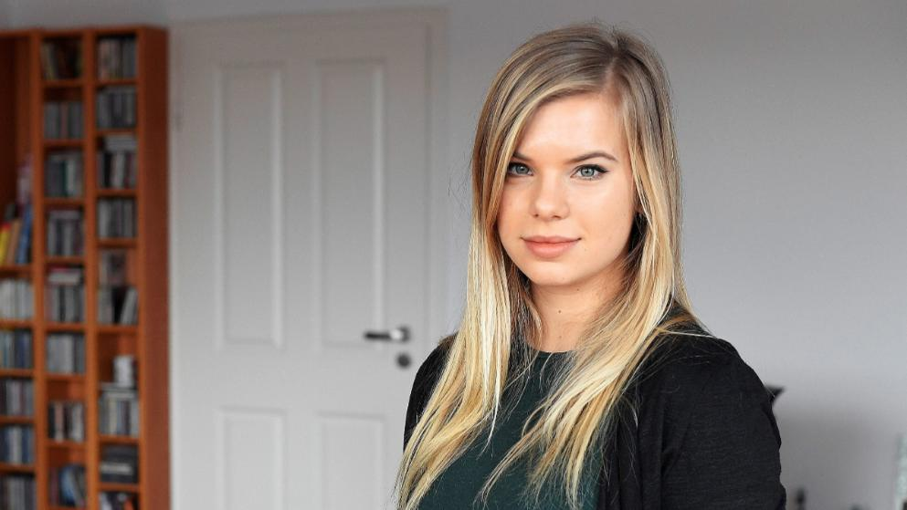
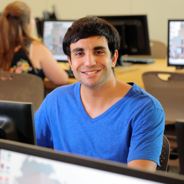

.Toru Rusch
|===
|Name |Hintergrund |Ziel

a|image::Bilder/Toru Rusch.jpg[float=center]
Toru Rusch (20)

|Er studiert Informatik im zweiten Semester an der HHU. Schon als Kind wollte er Sortware-Entwickler werden.
Er hat eine besondere Leidenschaft für Java.
|Jede Woche muss er Übungsblätter abgeben und findet das System zu langsam. Er wüscht sich, dass die Webseite schneller laufen würde.

|===

.Guilia Salla
|===
|Name |Hintergrund |Ziel

a|
Guilia Salla (25)
|Sie ist Studentin in der Richtung Informatik an der HHU.
Sie mag alle schöne Sachen.
Sie möchte in der Zukunft Web-Entwicklerin werden.
|Jede Woche muss sie Übungsblätter abgeben und findet, dass das User-Interface der Webseite nicht so schön aussieht.
Sie wünschte sich eine schönere Webseite.
|===

.Rula Eckel
|===
|Name |Hintergrund |Ziel

a|
Rula Eckel (26)
|Sie studiert Master in der Richtung Informatik an der HHU. Neben dem Studium ist sie auch Korrektorin für das Modul Theoretische Informatik.
|Jede Woche braucht sie 15 Stunden um die Übungsblätter zu korrigieren. Sie möchte die Möglichkeit haben, im System mit anderen Korrektoren
chatten zu können.

|===

.Valerian Daum
|===
|Name |Hintergrund |Ziel

a|image:Bilder/Valerian Daum.jpg[float=center]
Valerian Daum (24)
|Er ist ein Student der HHU. Er nimmt gerne an vielen Aktivitäten teil. Außerdem ist er ein guter Korrektor für das Modul Programmierung.
|Er möchte die Möglichkeit haben, seine Korrektur direkt in die Abgabe des Studenten zu schreiben.
So bräuchte er bei der Korrektur nicht immer die Zeile angeben, wo sich ein Fehler befindet und würde
dadurch Zeit sparen.

|===

.Marcell Borrmann
|===
|Name |Hintergrund |Ziel

a|image:bilder/Marcell Borrmann.jpg[float=center]
Marcell Borrmann (24)
|Er studiert als Doktor an der HHU. Weil er neben dem Studium auch Organisator im Fach Informatik ist,
hat er fast keine Zeit für andere Aktivitäten.
|Er findet, dass er zu viele unwichtigen Sachen (z.B Verteilen der Aufgaben ... ) machen muss. Er wünscht sich, dass unwichtige Sachen automatisch gemacht werden könnten.

|===

.Secer Dettmer
|===
|Name |Hintergrund |Ziel

a|image:Bilder/Secer Dettmer.jpg[float=center]
Secer Dettmer (24)
|Er ist ein Doktor. Er arbeitet auch im Siemens. Außerdem ist er ein Organisator an der HHU.
|Er denkt, dass das System zu viele Knöpfe hat. Er wünscht sich, dass es weniger wären.

|===

### Personas

.Persona 1
[cols="1,2,1" options="header"]
|===
|Name |Hintergrund |Ziel
| Robert Breuss  | Robert studiert Informatik im vierten Semester
und benutzt das Abgabe-System schon lange. Er hat schon viele Veranstaltungen
belegt, wo Übungsblätter über AUAS abgegeben werden mussten. Da seine Liste der Veranstaltungen
lang ist, verbraucht
er immer unnötig viel Zeit, um die richtige Veranstaltungen zu finden.

Er hat schon zweimal das Modul Programmierung
(2016 und 2017) belegt. Dazu kommen noch fünf verschiedene Module.
Alle haben mindesten 12 Blätter. Einmal ist ihm passiert, dass er ein Übungsblatt
in das falsche Modul abgegeben hat.
|Robert möchte schnell das richtige Modul finden.
|===

.Persona 2

[cols="1,2,1" options="header"]
|===
|Name |Hintergrund |Ziel
| Maya |
Maya studiert an der HHU im ersten Semester und fängt erst an, das
AUAS zu nutzen. Sie hat oft das Problem, dass ihre Dateien im falschen Datei-Format sind
und werden deswegen nicht gespeichert. Einmal ist ihr passiert, dass sie
die Fehlermeldung übersehen hat.
 | Sie will eine klare Fehlermeldung, wenn etwas beim Speichern nicht geklappt hat.
|===

.Persona 3
[cols="1,2,1" options="header"]
|===
|Name |Hintergrund |Ziel
| Rose  | Rose arbeitet als Korrektorin für viele Module an der HHU.
Deswegen vergisst sie manchmal, welche Module sie schon bearbeitet hat und welche noch
nicht.
| Rose will darüber informiert werden, welche Übungsblätter sie noch bearbeiten muss.
|===

.Persona 4
[cols="1,2,1" options="header"]
|===
|Name |Hintergrund |Ziel
| Mukti image:Bilder/Mukti.jpg[]| Mukti ist ein Korrektor für viele Module an der HHU. Er findet, dass das User-Interface
der Webseite AUAS kompliziert ist. Deswegen braucht er immer viel
Zeit, um das richtige Übungsblatt zu finden.
|Er möchte, dass das Interface vereinfacht wird.
|===

.Persona 5
[cols="1,2,1" options="header"]
|===
|Name |Hintergrund |Ziel
| Jack  | Jack ist ein Organisator an der HHU. Jedes Mal wenn er die Studenten
evaluieren will, verbraucht er viel Zeit.
| Er möchte, dass die AUAS Webseite die erreichten Punkte der Studenten in einer schönen Statistik anzeigt.
|===

.Persona 6
[cols="1,2,1" options="header"]
|===
|Name |Hintergrund |Ziel
| Thomas Müller | Thomas arbeitet schon lange als Organisator. Er ist sehr
beschäftigt und hat schon alle Übungsblätter für das kommende Semester im voraus vorbereitet.
 Er will keine Zeit damit verschwenden, jede Woche ein Übungsblatt hochladen zu müssen
| Er möchte die Möglichkeit haben, alle Übungsblätter schon zu Beginn des Semesters hochladen zu können und
das System so einzustellen, dass jede Woche ein Übungsblatt automatisch freigeschaltet wird.
|===

.Sarah Vanicka
|===
|Name |Hintergrund |Ziel

|Sarah Vanicka (22)

|Sarah ist Master Studentin der Informatik. Speziell interessiert sie sich für
App Entwicklung.
|Sarah ist es wichtig, dass Sie Übungsblätter mit wenigen Klicks abgeben kann
und dass Sie das Feedback der Korrektoren und die erreichte Punktezahl sieht.
|===

.Tom Müller
|===
|Name |Hintergrund |Ziel

|Tom Müller (21)

|Tom ist Informatik Student und belegt dieses Semester die Veranstaltung
Softwareentwickung im Team. In seiner freien Zeit spielt er gerne Computer Spiele.
|Tom ist es wichtig, dass das Abgabesystem schnell funktioniert. Auch möchte er
immer eine klare Bestätigung über die erfolgreiche Abgabe eines Blatts.
|===

.Franco Milic
|===
|Name |Hintergrund |Ziel

|Franco Milic (25)

|Franco ist Korrektor für die Veranstaltung Programmierung. Er wird sein Informatik
Studium bald beendet haben und möchte später gerne als Webentwickler arbeiten.
|Franco wünscht sich ein System wo Abgaben der Studierenden klar voneinander getrennt sind
und er den Bearbeitungsstand vermerken kann.
|===

.Sebastian Kangler
|===
|Name |Hintergrund |Ziel

|Sebastian Kangler (23)

|Sebastian hat Softwareentwickung im Team schon gemacht und arbeitet dieses
Semester als Korrektor. Ihm ist es wichtig, dass die Übungsbätter gut gekenzeichnet sind
so, dass er sie einfach den Studenten zuordnen kann.
|"Im System möchte ich Übungsblätter klar voneinander trennen und herunterladen
können."
|===

.Vanessa Pfaffenzeller
|===
|Name |Hintergrund |Ziel

|Vanessa Pfaffenzeller (27)

|Auch Vanessa hat ihr Informatik Studium beendet und leitet die Übung für die
Veranstaltung Bioinformatik. Sie ist gerne Übungsleiterin und freut sicht
besonders wenn ihre Studenten Übungsbätter gut bearbeitet haben.
|"Es wäre nett wenn der Fortschritt der Korrektoren und Studenten
graphisch angezeigt werden könnte."
|===

.Oliver Mertens
|===
|Name |Hintergrund |Ziel

|Oliver Mertens (28)

|Oliver hat sein Informatik Studium schon beendet und macht im Moment seinen
Doktor im Bereich Machine Learning. Nebenbei arbeitet er als Übungsleiter für
die Veranstaltung Machine Learning. Da ihm Lehren Spaß macht betreut er Nachmittags zusätzlich
ein paar Schüller als Aushilfelehrer.
|"Ich möchte Übungsbätter fair unter die Korrektoren verteilen und deren Fortschritt
verfolgen können. Auch wäre die Möglichkeit einer Erinnerung/Abmahnung eines Korrektors hilfreich."
|===
